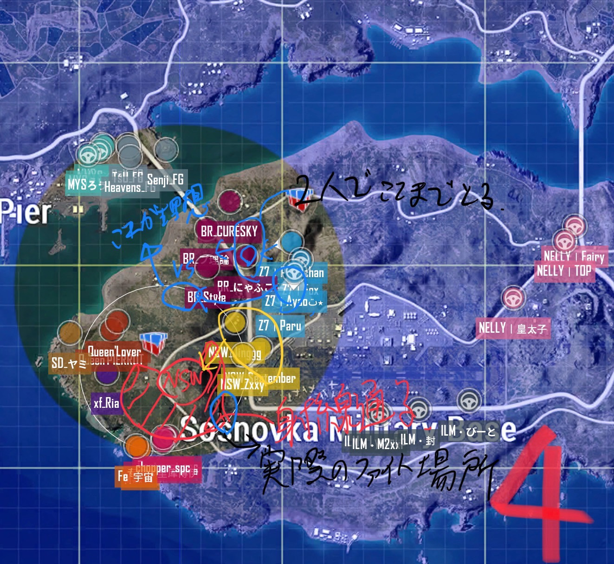
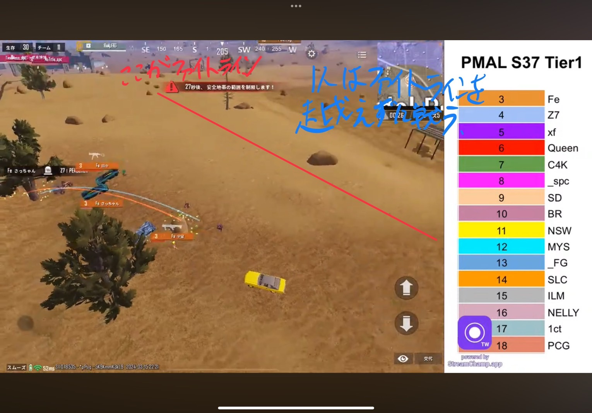

# PMAL_S37_ドキュメント

## 目次
- [PMAL\_S37\_ドキュメント](#pmal_s37_ドキュメント)
  - [目次](#目次)
  - [事前準備](#事前準備)
  - [Day1](#day1)
    - [R1(Erangel)](#r1erangel)
    - [R2(Miramar)](#r2miramar)
    - [R3(Erangel)](#r3erangel)
    - [総評](#総評)
    - [共有事項](#共有事項)
  - [Day2](#day2)
    - [R4(Miramar)](#r4miramar)
    - [R5(Erangel)](#r5erangel)
    - [R6(Miramar)](#r6miramar)
    - [総評](#総評-1)
  - [Day3](#day3)
    - [R7(Erangel)](#r7erangel)
    - [R8(Miramar)](#r8miramar)
    - [R9(Erangel)](#r9erangel)
    - [総評](#総評-2)
  - [Day4](#day4)
    - [R10(Miramar)](#r10miramar)
    - [R11(Erangel)](#r11erangel)
    - [R12(Miramar)](#r12miramar)
    - [総評](#総評-3)
    - [共有事項](#共有事項-1)
  - [Day5](#day5)
    - [R13(Erangel)](#r13erangel)
    - [R14(Miramar)](#r14miramar)
    - [R15(Erangel)](#r15erangel)
    - [総評](#総評-4)
  - [Day6](#day6)
    - [R16(Miramar)](#r16miramar)
    - [R17(Erangel)](#r17erangel)
    - [R18(Miramar)](#r18miramar)
    - [総評](#総評-5)

## 事前準備
- 1R目はスクマン4人で降りる(1ctとワンチ被る)
- ムーブは際多め予定(リーグは極端ずれが多いことに留意する) 
  →決め打ちのムーブも視野に入れる
- 車の位置、向きは要確認

## Day1
### R1(Erangel)
- 結果
   
  5位8キル14pt

- 良かった点
 
安置の極振りに対してまっすぐ入ることが意識できた
 
ファイト勝ち切れた

- 改善点
 
NSWのファイトで枚数欠けた
 
エイム渋いぺこ

- 改善方法
 
ファイト時は味方とのラインを意識する
 
練習するペコ

### R2(Miramar)
- 結果
 
4位3キル11pt

- 良かった点
 
安置の極振りに対応できた

- 改善点
 
内側をあまり見えてなかった(モンテ入りの後)

- 改善方法
 
周りの敵に意識を避けすぎないようにする

### R3(Erangel)
- 結果
 
11位2キル3pt

- 良かった点
 
セオリー通りのムーブができていた
 
ポジションの優位性が判断できていた
 
視点の分配ができていた

- 改善点
 
ほかの敵を意識できていなかった(spcのとこ)

- 改善方法
 
深追いするかは今いるポジション、ほかの敵の状況を判断して行う
 
シェルターに関しては閉じ込めて終わりでもいい

### 総評
 
ムーブはまあまあまあ
 
ファイトは味方を意識する
 
一旦落ち着いたら、次のアクションを状況をもとに判断する

### 共有事項
 
ムーブの傾向は第1フェーズに対してランマが入っているところは中央、ずれているところは際でムーブしている
 
傾向的には安置に対して回って入るチームがやや多そう

## Day2
### R4(Miramar)
- 結果
 
5位13キル19pt

- 良かった点
 
STEスプリットの動きが刺さった

- 改善点
 
xfのところで1枚欠けた

- 改善方法
 
第3フェーズでSTEのスプリットをする

### R5(Erangel)
- 結果
 
5位6キル12pt

- 良かった点
 
天空倒すところまで行けた
 
投げものうまく使ってファイトできた

- 改善点
 
spcやった後の内側の情報取りが甘かった

- 改善方法
 
より内側に車を回して情報をとる

### R6(Miramar)
- 結果
-  
6位10キル14pt

- 良かった点
 
ファイト勝てた

- 改善点
 
ムーブは渋い

- 改善方法
 
2連レンガ倉庫まで取って西側にアプローチできるようにする(ロス東は東に行くにつれて誓いが低くなっているため)

### 総評
 
ファイト勝てた

## Day3
### R7(Erangel)
- 結果
 
9位2キル3pt

- 良かった点
 
とりあえず、4任生存で南に渡れた

- 改善点
 
第4フェーズで橋側の情報が取れなかった
 
ポジションからの取れる情報が取り切れていなかった

- 改善方法
 
カバーを置きつつ、より先へ行くことを意識する
 
強ポジに対して抗えるムーブをする
 

### R8(Miramar)
- 結果
 
2位4キル14pt

- 良かった点
 
順位伸びた

- 改善点
エイム渋いペコ

- 改善方法
 
練習するペコ

### R9(Erangel)
- 結果
 
15位0キル0pt

- 良かった点
 
うむ

- 改善点
 
4タテされたペコ

- 改善方法
 
1枚だからと言って甘えない

### 総評
 
中盤以降、情報取りを意識してプレイする。(空いている家屋、稜線、抜けの確認等)

## Day4
### R10(Miramar)
- 結果
   
12位3キル4pt
- 良かった点
 
ムーブ自体は悪くなかった(勝てるムーブではあった)
- 改善点
 
Feファイトの仕掛け方がいまいちだった
- 改善方法
 
稜線ファイトで仕掛ける際は一人は本来のファイトラインで戦う
(相手のポジションが自分たちより弱い場合)

### R11(Erangel)
- 結果
  
12位1キル2pt
- 良かった点
 
ドン勝まで見えてるムーブはしてた
- 改善点
 
裏を外すタイミングが早かった
- 改善方法
 
第4収縮までは裏のケアは頭に入れておく
 
硬直している場合、先入りしておくのも視野に入れる

### R12(Miramar)
- 結果
  
12位2キル3pt
- 良かった点
 
pまでとるムーブはよかった
- 改善点
 
山からチェックできるポジションのチェックが遅い
 
SLCのファイトで連携が取れてなかった
- 改善方法
 
ポジションについたらそこから見えるポジションをまずはチェックする
 
引いたか未確定の位置には投げ物でクリアリングをする

### 総評
 
チームでファイトすることを意識する

### 共有事項
 
中盤以降に内側の情報をとることを意識する
 
ファイトは投げものを使う意識を持つ

## Day5
### R13(Erangel)
- 結果

- 良かった点

- 改善点

- 改善方法

### R14(Miramar)
- 結果

- 良かった点

- 改善点

- 改善方法

### R15(Erangel)
- 結果

- 良かった点

- 改善点

- 改善方法

### 総評

## Day6
### R16(Miramar)
- 結果

- 良かった点

- 改善点

- 改善方法

### R17(Erangel)
- 結果

- 良かった点

- 改善点

- 改善方法

### R18(Miramar)
- 結果

- 良かった点

- 改善点

- 改善方法

### 総評

